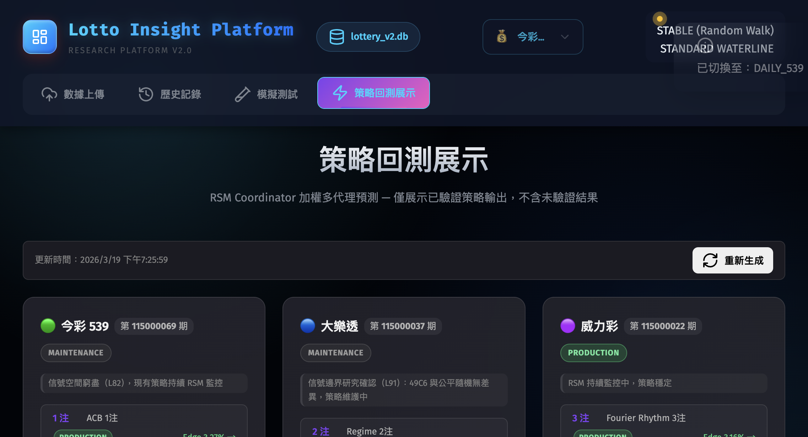

> ⚠️ **This project is for academic statistical research only. It does not provide betting advice and is not affiliated with any lottery operator.**

# lottery Insight and Research Platform

A statistical research platform for public draw games: 539 (5/39), big lotto (6/49), and Power lotto (6/38+8).
Research-driven, tracking strategy performance and documenting findings.

**This is not a prediction tool and does not provide betting advice.**

---

## Screenshots

| Strategy Backtest | Simulation Test | Draw History |
|---|---|---|
|  |  |  |

---

## Research Findings (Updated 2026-03-19)

| Game | Status | Conclusion |
|------|--------|------------|
| 539 (5/39) | Maintenance | Signal space exhausted (L82): H001~H008 all REJECTED, active strategies under RSM monitoring |
| big lotto (6/49) | Maintenance | Indistinguishable from fair random process (L91): 6 randomness tests passed, no actionable signal in 49C6 |
| Power lotto (6/38+8) | RSM Monitoring | Some strategies hold positive 300p Edge, but ruin_prob = 1.000 for all games |

**Important**: Negative expected value confirmed for all games. The "Next Draw" page visualizes research outputs only — not betting recommendations.

---

## Architecture

```
Backend API  → http://localhost:8002   (FastAPI)
Frontend     → http://localhost:8081   (Vanilla JS SPA)
Prediction   → tools/quick_predict.py
Strategy Mon → RSM (lottery_api/engine/rolling_strategy_monitor.py)
```

---

## Project Scale

| Type | Files | Lines |
|------|-------|-------|
| Python `.py` | 4,551 | 1,811,215 |
| JavaScript `.js` | 112 | 30,385 |
| Markdown `.md` | 365 | 73,018 |
| HTML `.html` | 37 | 17,846 |
| CSS | — | 6,186 |
| **Total** | **8,293** | **~1.9M** |

---

## Quick Start

```bash
# Start all services (frontend + backend)
./start_all.sh

# Stop all services
./stop_all.sh

# Run prediction (CLI)
python3 tools/quick_predict.py all

# Open frontend
open http://localhost:8081
```

---

## Directory Structure

| Path | Description |
|------|-------------|
| `lottery_api/` | FastAPI backend, prediction engine, RSM monitoring |
| `src/` | Vanilla JS single-page app |
| `tools/` | Backtest, research, and maintenance scripts |
| `docs/` | Technical documents and research reports |
| `memory/` | Auto-memory (persists across sessions) |
| `research/` | Research scripts and exploratory analysis |
| `rejected/` | Rejected strategy archive (with failure reasons) |
| `data/` | Strategy monitoring cache (RSM state) |

---

## Documentation

| File | Description |
|------|-------------|
| [docs/MASTER_GUIDE.md](docs/MASTER_GUIDE.md) | System architecture and current strategy status |
| [docs/EXECUTIVE_SUMMARY_2026.md](docs/EXECUTIVE_SUMMARY_2026.md) | 2026 research executive summary |
| [docs/BACKTEST_PROTOCOL.md](docs/BACKTEST_PROTOCOL.md) | Backtest protocol and validation standards |
| [docs/BACKTEST_REPORTS_INDEX.md](docs/BACKTEST_REPORTS_INDEX.md) | Backtest report index |
| [docs/sb3_final_recommendation.md](docs/sb3_final_recommendation.md) | RL research final report |
| [docs/decision_payout_report.md](docs/decision_payout_report.md) | Decision layer analysis |
| [lottery_api/CLAUDE.md](lottery_api/CLAUDE.md) | Strategy specification (primary reference) |

---

## Active Strategies

### 539 — 5/39 (Maintenance Mode)

| Bets | Strategy | 300p Edge | Status |
|------|----------|-----------|--------|
| 1 | acb_1bet | +3.27% | PRODUCTION |
| 2 | midfreq_acb_2bet | +8.46% | PRODUCTION |
| 3 | acb_markov_midfreq_3bet | +8.50% | PRODUCTION |
| 5 | f4cold_5bet | +6.61% | PRODUCTION |

### big lotto — 6/49 (Maintenance Mode)

| Bets | Strategy | 300p Edge | Status |
|------|----------|-----------|--------|
| 2 | regime_2bet | +3.64% | PRODUCTION |
| 3 | ts3_regime_3bet | +3.51% | PRODUCTION |
| 5 | p1_dev_sum5bet | +3.71% | PRODUCTION |

### Power lotto — 6/38+8 (RSM Monitoring)

| Bets | Strategy | 300p Edge | Status |
|------|----------|-----------|--------|
| 3 | fourier_rhythm_3bet | +3.16% | PRODUCTION |
| 4 | pp3_freqort_4bet | +3.40% | PRODUCTION |
| 5 | orthogonal_5bet | +2.76% | WATCH |

---

## Risk Disclaimer

> This project is for **research and statistical analysis purposes only**.
>
> - **Not financial advice**: Nothing in this system constitutes investment or betting advice
> - **No guarantee of winning**: Past statistical patterns do not predict future draw outcomes
> - **Negative expected value**: All draw games have negative EV; continued play results in guaranteed long-term losses (ruin probability = 1.000)
> - **Use at your own risk**: The authors are not liable for any financial losses incurred from using this system
> - **Research system only**: All outputs visualize research findings, not winning number recommendations

**If you have a gambling problem, please seek help.**

---

## Discussion & Contribution

This project has hit a wall in statistical signal exploration .
If you are interested in probability analysis, time series, or draw game statistics, feel free to exchange ideas.

- New analysis angle or hypothesis? Open an **Issue**
- Found a bug or data issue? **PRs welcome**
- Just want to discuss research direction? Open an Issue

---

## License

MIT License — Copyright (c) 2026 Kelvin. See [LICENSE](LICENSE) for details.
