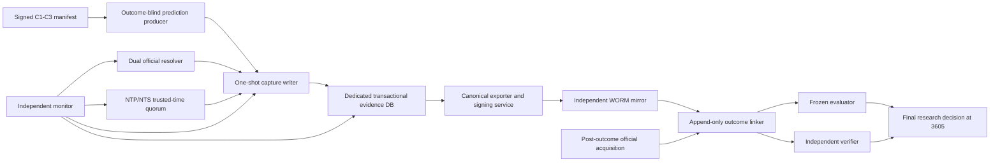

# P274C G1 Prospective Execution Decision Resolution Design

- **Task:** `P274C_G1_PROSPECTIVE_EXECUTION_DECISION_RESOLUTION_DESIGN`
- **Mode:** comprehensive G1 design and owner-decision resolution only
- **Canonical payload digest:** `873dc804130ca1e737e6430ac114791c15277a2799b7567279d809f8b7fc51a6`
- **G1 outcome:** `G1_COMPLETE_READY_FOR_SEPARATE_G2_AUTHORIZATION`
- **Recommended architecture:** `RECOMMENDED_RESILIENT_LONG_HORIZON`
- **Prediction success claim:** `false`

> G1 architecture does not create predictive edge. It preserves future-only integrity so a real edge can be detected and a retrospective or contaminated edge cannot be mislabeled as success. G2 implementation, production apply, activation, boundary assignment, and capture remain unauthorized.

## 1. Frozen Scientific Contract

- Candidates: `acb_markov_midfreq_3bet`, `daily539_f4cold_3bet`, `daily539_f4cold_5bet` (DAILY_539 only).
- Endpoint: prize-aware M2+, `hit_count>=2`. Exact distinct-ticket null unchanged.
- Bonferroni `m=3`, per-candidate alpha `0.05/3`; 50 integrity-only; 300 non-binding futility-only; no interim efficacy.
- Final horizon: `3605` valid future observations; no result-triggered optional extension; no historical backfill.
- Boundary: `UNSET_PENDING_SEPARATE_ACTIVATION_AUTHORIZATION`.
- P274A digest: `f2294716699368a9c2b21fb14301d84d70f662b882aef9eab896f96825f18ffc`; P274B digest: `bf8ae32f8dbd208da4939ee46cdbe19125827f36c3a80aedefc8fee21a994744`.

## 2. Outcome And Counts

| Measure | Count |
|---|---:|
| `existing_decision_count` | 14 |
| `existing_resolved_count` | 14 |
| `existing_deferred_count` | 0 |
| `additional_decision_count` | 8 |
| `additional_resolved_count` | 8 |
| `additional_deferred_count` | 0 |
| `option_count_total` | 89 |
| `rejected_option_count` | 67 |
| `conditional_option_count` | 14 |
| `blocking_deferred_count` | 0 |

All 14 canonical P274B decisions were preserved by ID and question, examined, and dispositioned. Eight genuinely uncovered mandatory decisions were added. No decision is deferred. Conditional selections remain blocked on explicit pre-G2 acceptance evidence; this document does not authorize G2.

## 3. Complete Decision Table

| ID | Canonical question | Type | Disposition | Selected option | Responsible role | Production evidence required |
|---|---|---|---|---|---|---|
| `OD-01` | Proceed to G1 approval, HOLD, or scientific closure | `EXISTING_CANONICAL` | `RESOLVED_SELECTED` | `OD01-A` | Owner / Scientific Sponsor | `false` |
| `OD-02` | Evidence-store architecture | `EXISTING_CANONICAL` | `RESOLVED_CONDITIONAL_WITH_PREIMPLEMENTATION_GATES` | `OD02-E` | Prospective Service Owner | `false` |
| `OD-03` | Official schedule authority and fallback | `EXISTING_CANONICAL` | `RESOLVED_CONDITIONAL_WITH_PREIMPLEMENTATION_GATES` | `OD03-E` | Schedule Resolver Owner | `false` |
| `OD-04` | Trusted clock and maximum drift | `EXISTING_CANONICAL` | `RESOLVED_CONDITIONAL_WITH_PREIMPLEMENTATION_GATES` | `OD04-E` | Trusted Time Owner | `false` |
| `OD-05` | Maximum tolerated capture gaps and missingness rule | `EXISTING_CANONICAL` | `RESOLVED_SELECTED` | `OD05-D` | Scientific Protocol Steward | `false` |
| `OD-06` | Service/on-call/scientific/security ownership | `EXISTING_CANONICAL` | `RESOLVED_CONDITIONAL_WITH_PREIMPLEMENTATION_GATES` | `OD06-D` | Owner / Scientific Sponsor | `false` |
| `OD-07` | Retention and independent evidence durability | `EXISTING_CANONICAL` | `RESOLVED_CONDITIONAL_WITH_PREIMPLEMENTATION_GATES` | `OD07-D` | Evidence Custodian | `false` |
| `OD-08` | Signing and key custody | `EXISTING_CANONICAL` | `RESOLVED_CONDITIONAL_WITH_PREIMPLEMENTATION_GATES` | `OD08-C` | Security / Key Custodian | `false` |
| `OD-09` | Permissible pre-close correction classes | `EXISTING_CANONICAL` | `RESOLVED_SELECTED` | `OD09-D` | Scientific Protocol Steward | `false` |
| `OD-10` | Infrastructure migration and dependency upgrade policy | `EXISTING_CANONICAL` | `RESOLVED_CONDITIONAL_WITH_PREIMPLEMENTATION_GATES` | `OD10-D` | Release / Migration Approver | `false` |
| `OD-11` | Prolonged outage resume/closure rule | `EXISTING_CANONICAL` | `RESOLVED_SELECTED` | `OD11-D` | Incident Commander / Scientific Protocol Steward | `false` |
| `OD-12` | Cost/resource commitment for 3605 draws | `EXISTING_CANONICAL` | `RESOLVED_CONDITIONAL_WITH_PREIMPLEMENTATION_GATES` | `OD12-A` | Owner / Resource Sponsor | `false` |
| `OD-13` | Periodic non-efficacy scientific-value review cadence | `EXISTING_CANONICAL` | `RESOLVED_SELECTED` | `OD13-D` | Scientific Protocol Steward / Owner | `false` |
| `OD-14` | Future G2 implementation scope | `EXISTING_CANONICAL` | `RESOLVED_SELECTED` | `OD14-A` | Owner / G2 Authorizer | `false` |
| `AD-01` | How are P274A candidates, fields, strategy/scorer versions, ticket identities, and dependency provenance sealed and mapped? | `ADDITIONAL_P274C` | `RESOLVED_CONDITIONAL_WITH_PREIMPLEMENTATION_GATES` | `AD01-D` | Candidate Manifest Custodian / Scientific Protocol Steward | `false` |
| `AD-02` | What end-to-end runtime topology separates prediction generation, capture, evidence sealing, outcome linkage, and evaluation? | `ADDITIONAL_P274C` | `RESOLVED_SELECTED` | `AD02-E` | Prospective Service Owner | `false` |
| `AD-03` | What monitoring, alerting, and escalation thresholds govern live prospective operation? | `ADDITIONAL_P274C` | `RESOLVED_CONDITIONAL_WITH_PREIMPLEMENTATION_GATES` | `AD03-D` | Operations Primary / Backup | `false` |
| `AD-04` | What security and least-privilege model protects activation, capture, archive, outcome linkage, evaluation, and manual actions? | `ADDITIONAL_P274C` | `RESOLVED_CONDITIONAL_WITH_PREIMPLEMENTATION_GATES` | `AD04-D` | Security / Key Custodian | `false` |
| `AD-05` | How is the prospective evaluator frozen, separated from outcomes, reproduced, and independently verified? | `ADDITIONAL_P274C` | `RESOLVED_CONDITIONAL_WITH_PREIMPLEMENTATION_GATES` | `AD05-D` | Scientific Protocol Steward / Independent Verifier | `false` |
| `AD-06` | What restart, crash recovery, backup, restore, and disaster-recovery behavior preserves evidence without backfill? | `ADDITIONAL_P274C` | `RESOLVED_CONDITIONAL_WITH_PREIMPLEMENTATION_GATES` | `AD06-D` | Prospective Service Owner / Operations Primary | `false` |
| `AD-07` | What state machine governs suspension, resumption, candidate closure, lottery-rule changes, and protocol invalidation? | `ADDITIONAL_P274C` | `RESOLVED_SELECTED` | `AD07-D` | Scientific Protocol Steward / Owner | `false` |
| `AD-08` | How are official outcome acquisition, availability timestamps, result linkage, and evaluator inputs separated from pre-outcome capture? | `ADDITIONAL_P274C` | `RESOLVED_CONDITIONAL_WITH_PREIMPLEMENTATION_GATES` | `AD08-D` | Outcome Linker Operator | `false` |

### 3.1 Canonical 14 Reconciliation

| ID | P274B status | Evidence | Readiness requirements | Failure modes | Dependencies | Owner authorization sufficient |
|---|---|---|---|---|---|---|
| `OD-01` | `OWNER_DECISION_REQUIRED` | P274B G0 complete/G1 partial; P274A frozen future-only contract; Direct P274C owner direction supersedes prior HOLD | `P271-01`, `P271-02`, `P271-03`, `P271-04`, `P271-05`, `P271-06` | `FM-01`, `FM-18` | `OD-02 through OD-14`, `AD-01 through AD-08` | `true` |
| `OD-02` | `OWNER_DECISION_REQUIRED` | P271J proves isolated transactional append-only primitives; P271K proves temp-DB install/rollback/idempotence; P271L reports production prospective namespace ABSENT_CLEAN; SQLite WAL requires coordinated sidecar handling | `P271-02`, `P271-03`, `P271-04`, `P271-05`, `P271-06`, `P271-08`, `P271-17`, `P271-22`, `P271-25`, `P271-28` | `FM-04`, `FM-13`, `FM-14`, `FM-15`, `FM-17`, `FM-26` | `OD-07`, `OD-08`, `OD-10`, `AD-02`, `AD-04`, `AD-06` | `true` |
| `OD-03` | `OWNER_DECISION_REQUIRED` | P271J supports official source classes; P274A requires deterministic official target identity; P274B marks resolver missing | `P271-09`, `P271-10`, `P271-14`, `P271-19` | `FM-10`, `FM-11`, `FM-25`, `FM-27` | `OD-04`, `OD-11`, `AD-02`, `AD-03`, `AD-08` | `true` |
| `OD-04` | `OWNER_DECISION_REQUIRED` | P271J requires caller-supplied skew margin; RFC 8633 multi-source practice; RFC 8915 NTS; RFC 3161 optional external timestamp evidence | `P271-09`, `P271-24`, `P271-28` | `FM-02`, `FM-21`, `FM-25` | `OD-03`, `OD-08`, `OD-11`, `AD-03` | `true` |
| `OD-05` | `OWNER_DECISION_REQUIRED` | P274A requires complete support, no substitution, fixed m=3 and 3605 valid observations; P274B requires a governed threshold; P271J can preserve rejected attempts | `P271-16`, `P271-19`, `P271-20`, `P271-21`, `P271-29` | `FM-03`, `FM-19`, `FM-20`, `FM-21`, `FM-22`, `FM-27`, `FM-28` | `OD-11`, `AD-03`, `AD-06`, `AD-07` | `true` |
| `OD-06` | `OWNER_DECISION_REQUIRED` | P274B finds no owner/on-call roster; NIST audit controls support separated accountability | `P271-21`, `P271-23`, `P271-25`, `P271-26`, `P271-30` | `FM-20`, `FM-21`, `FM-24`, `FM-26` | `OD-08`, `OD-12`, `OD-13`, `AD-03`, `AD-04` | `true` |
| `OD-07` | `OWNER_DECISION_REQUIRED` | P274B local hashes do not protect against single-store loss; NIST log management guidance; WORM prevents overwrite/delete during retention | `P271-08`, `P271-22`, `P271-25`, `P271-28`, `P271-30` | `FM-14`, `FM-15`, `FM-26` | `OD-02`, `OD-08`, `OD-10`, `OD-12`, `AD-06` | `true` |
| `OD-08` | `OWNER_DECISION_REQUIRED` | P271J hashes are local tamper evidence only; RFC 3161/4998 describe signed temporal evidence; P274B makes key custody an owner decision | `P271-08`, `P271-22`, `P271-28`, `P271-30` | `FM-14`, `FM-15`, `FM-24`, `FM-26` | `OD-02`, `OD-06`, `OD-07`, `AD-04` | `true` |
| `OD-09` | `OWNER_DECISION_REQUIRED` | P271J atomic rollback and append-only amendments; P274A prohibits outcome-aware correction and substitution | `P271-13`, `P271-16`, `P271-17`, `P271-18`, `P271-27` | `FM-04`, `FM-05`, `FM-06`, `FM-16`, `FM-17`, `FM-18` | `OD-03`, `OD-04`, `AD-01`, `AD-02` | `true` |
| `OD-10` | `OWNER_DECISION_REQUIRED` | P271K additive install and rollback rehearsal; P271L WAL, backup, quiescence and apply gates; P274A prohibits version substitution | `P271-04`, `P271-05`, `P271-06`, `P271-08`, `P271-11`, `P271-12`, `P271-18`, `P271-20`, `P271-22`, `P271-25`, `P271-28`, `P271-29` | `FM-07`, `FM-08`, `FM-12`, `FM-13`, `FM-15`, `FM-23`, `FM-26`, `FM-28` | `OD-02`, `OD-07`, `OD-08`, `OD-11`, `OD-13`, `AD-01`, `AD-05`, `AD-06` | `true` |
| `OD-11` | `OWNER_DECISION_REQUIRED` | P274A no backfill and insufficient-support class; P274B outage and recovery gaps | `P271-16`, `P271-19`, `P271-20`, `P271-21`, `P271-24`, `P271-25`, `P271-26` | `FM-02`, `FM-03`, `FM-19`, `FM-20`, `FM-21`, `FM-27`, `FM-28` | `OD-05`, `OD-06`, `OD-07`, `OD-13`, `AD-03`, `AD-06`, `AD-07` | `true` |
| `OD-12` | `OWNER_DECISION_REQUIRED` | P274A horizon is 3605 draws and about 11.5 years descriptively; P274B resource plan unknown; Owner direction says difficulty alone is not grounds for rejection | `P271-21`, `P271-25`, `P271-26`, `P271-30` | `FM-19`, `FM-20`, `FM-21`, `FM-26`, `FM-28` | `OD-06`, `OD-07`, `OD-13` | `true` |
| `OD-13` | `OWNER_DECISION_REQUIRED` | P274A forbids interim efficacy; P274B requires value review and rule surveillance | `P271-26`, `P271-29` | `FM-08`, `FM-12`, `FM-23` | `OD-06`, `OD-10`, `OD-12`, `AD-05`, `AD-07` | `true` |
| `OD-14` | `OWNER_DECISION_REQUIRED` | P274B implementation prerequisites; P274A capture contract; All P274C decisions | `P271-01`, `P271-02`, `P271-03`, `P271-04`, `P271-05`, `P271-06`, `P271-07`, `P271-08`, `P271-09`, `P271-10`, `P271-11`, `P271-12`, `P271-13`, `P271-14`, `P271-15`, `P271-16`, `P271-17`, `P271-18`, `P271-19`, `P271-20`, `P271-21`, `P271-22`, `P271-23`, `P271-24`, `P271-25`, `P271-26`, `P271-27`, `P271-28`, `P271-29`, `P271-30` | `FM-01`, `FM-02`, `FM-03`, `FM-04`, `FM-05`, `FM-06`, `FM-07`, `FM-08`, `FM-09`, `FM-10`, `FM-11`, `FM-12`, `FM-13`, `FM-14`, `FM-15`, `FM-16`, `FM-17`, `FM-18`, `FM-19`, `FM-20`, `FM-21`, `FM-22`, `FM-23`, `FM-24`, `FM-25`, `FM-26`, `FM-27`, `FM-28` | `OD-02 through OD-13`, `AD-01 through AD-08` | `true` |

### 3.2 Mandatory Domain Mapping

| Domain | Decisions |
|---|---|
| end-to-end capture architecture | `OD-02`, `AD-02`, `AD-08` |
| production/runtime ownership | `OD-06`, `AD-02` |
| trusted clock | `OD-04` |
| official draw-close and target-draw resolver | `OD-03` |
| P274A field/version mapping | `AD-01` |
| immutable storage and evidence identity | `OD-02`, `OD-07`, `OD-08`, `AD-01` |
| monitoring and alerting | `AD-03` |
| access control and security | `OD-06`, `OD-08`, `AD-04` |
| retention and archive | `OD-07` |
| restart and disaster recovery | `OD-11`, `AD-06` |
| governed missingness/capture-gap threshold | `OD-05`, `OD-11` |
| frozen prospective evaluator | `AD-05` |
| long-horizon maintenance and handoff | `OD-06`, `OD-12`, `OD-13` |
| migration/version evolution | `OD-10`, `AD-01`, `AD-05` |
| suspension/resumption/protocol invalidation | `OD-11`, `AD-07` |

### 3.3 Option Evaluations

#### OD-01 - Proceed to G1 approval, HOLD, or scientific closure

**Disposition:** `RESOLVED_SELECTED`; **selected:** `OD01-A`. The owner explicitly superseded HOLD and authorized exhaustive G1 resolution; a coherent scientifically valid path exists without authorizing implementation or activation.

| Option | State | Benefits | Disadvantages | Integrity / confirmation effect | Failure, security, migration, long-term risks | Reason |
|---|---|---|---|---|---|---|
| `OD01-A` Approve G1 reference architecture only | `SELECTED` | Creates a governed path to future confirmation while preserving separate gates. | Requires substantial pre-G2 evidence and long-term commitment. | Positive: resolves architecture without weakening protocol. / Positive: maximizes the chance a real future edge can be detected truthfully. | Later gates may fail and return to HOLD.; Commitments must be maintained. | Selected by direct owner direction; workload alone is not a reason to reject. |
| `OD01-B` Continue HOLD | `REJECTED` | Avoids cost and operational risk. | Cannot gather future-only evidence. | Neutral but produces no prospective evidence. / Probability of confirmation remains zero. | Scientific opportunity expires unused.; Permanent uncertainty. | Rejected because the owner superseded HOLD and a credible path exists. |
| `OD01-C` Scientific closure now | `REJECTED` | Eliminates operational exposure. | Abandons a credible prospective test. | Scientifically honest but terminates learning. / No future confirmation is possible. | Permanent closure. | Rejected because evidence does not show every credible path is impossible. |

Pre-G2 evidence: P274C decision set approved as the G1 reference; No G2 task starts without a new explicit authorization. Invalidation: Any contradiction with the frozen P274A contract; Any need for retrospective repair or outcome-aware substitution.

#### OD-02 - Evidence-store architecture

**Disposition:** `RESOLVED_CONDITIONAL_WITH_PREIMPLEMENTATION_GATES`; **selected:** `OD02-E`. A dedicated transactional evidence store plus an independently immutable mirror best separates production operations from confirmatory evidence while preserving atomicity and durable tamper evidence.

| Option | State | Benefits | Disadvantages | Integrity / confirmation effect | Failure, security, migration, long-term risks | Reason |
|---|---|---|---|---|---|---|
| `OD02-A` Do nothing; no prospective store | `REJECTED` | No implementation burden. | No auditable prospective evidence. | Invalid. / Prevents confirmation. | No capture exists. | Rejected as scientifically incapable. |
| `OD02-B` P271J schema in production operational DB | `REJECTED` | Reuses tested SQLite primitives. | Couples evidence to operational writers, WAL, access, backup, and migration. | Potentially valid but weaker isolation. / Possible but contamination risk is higher. | Writer collision; WAL/SHM mishandling; Shared production credentials; Production schema migration; Single-store dependence | Rejected because production coupling adds integrity risk without scientific benefit. |
| `OD02-C` Dedicated append-only evidence database only | `REJECTED` | Strong isolation and transactions. | No independent immutability anchor. | Scientifically valid if controls pass. / Supports confirmation. | Store loss or privileged mutation; Admin compromise; Must preserve bytes and identities; Single-store corruption | Rejected as final selection because an independent mirror materially improves auditability. |
| `OD02-D` Object/file evidence only with manifests | `REJECTED` | Portable immutable blobs. | Weak atomic multi-ticket uniqueness and idempotency. | Can be valid but operational correctness is harder. / Risk of missing or duplicate objects. | Partial upload; manifest divergence; Bucket credential misuse; Object naming/version drift; Metadata index drift | Rejected as sole primary store; retained as archive layer. |
| `OD02-E` Dedicated transactional ledger plus independent WORM/signed evidence mirror | `SELECTED_CONDITIONAL` | Atomic capture, isolation, queryability, and independent tamper evidence. | More components, key custody, archive cost, and reconciliation. | Strongest proportionate integrity for the long horizon. / High: genuine success is detectable while retrospective mutation is exposed. | Ledger/mirror divergence; archive outage; key failure; Separate least-privilege credentials and key custody; Dual verification and old-store retention; Provider retirement and archive readability | Selected because integrity outweighs added complexity. |

Pre-G2 evidence: Choose a dedicated evidence DB technology and WORM-capable independent archive; Prove atomic append, uniqueness, no overwrite, canonical export, restore, and digest reconciliation on synthetic data; Keep the production operational DB outside the evidence trust boundary. Invalidation: Evidence store permits overwrite of sealed records; Mirror is writable by the capture worker; Ledger and mirror cannot be reconciled.

#### OD-03 - Official schedule authority and fallback

**Disposition:** `RESOLVED_CONDITIONAL_WITH_PREIMPLEMENTATION_GATES`; **selected:** `OD03-E`. Use an official machine-readable primary source corroborated by a separately fetched official published schedule; disagreement, unavailability, or ambiguous rescheduling fails closed.

| Option | State | Benefits | Disadvantages | Integrity / confirmation effect | Failure, security, migration, long-term risks | Reason |
|---|---|---|---|---|---|---|
| `OD03-A` Caller-supplied draw identity | `REJECTED` | Minimal build. | Identity and close time cannot be independently proven. | Invalid. / False-classification risk is high. | Wrong draw; post-close capture | Rejected because caller assertions are insufficient. |
| `OD03-B` Single official machine-readable source | `REJECTED` | Automatable and low latency. | Single-source outage or silent schema error. | Potentially valid but fragile. / Good when healthy; weak failure detection. | Source outage; schema drift; Endpoint/network trust; Endpoint version change; Source retirement | Rejected due to unacceptable single-source failure. |
| `OD03-C` Single official published schedule with cached snapshot | `REJECTED` | Human-auditable and cacheable. | Less structured and slower on exceptions. | Potentially valid. / Moderate. | Parsing ambiguity; stale schedule; Format changes | Rejected as sole source; retained for corroboration. |
| `OD03-D` Repository schedule with manual exception handling | `REJECTED` | Works during network outage. | Cannot prove delays or cancellations. | Only suitable for pause decisions. / Low. | Unseen exception; Unauthorized override; Configuration drift; Calendar changes | Rejected for confirmatory capture; may only suspend. |
| `OD03-E` Official machine-readable primary plus official published corroboration and fail-closed exceptions | `SELECTED_CONDITIONAL` | Detects disagreement and preserves raw evidence. | Two parsers and health monitors. | Strong future-only identity proof. / High: wrong-draw contamination is reduced. | Both sources unavailable; shared upstream error; Parser/source provenance; Dual-run on migration; Source retirement | Selected; manual input never creates a confirmatory record. |

Pre-G2 evidence: Document exact official endpoints and manual verification; Store raw responses, fetch times, source versions, Asia/Taipei and UTC normalized times; Pass cancellation, delay, reschedule, ROC/Gregorian, timezone, and disagreement fixtures. Invalidation: Wrong target draw; Disagreement overridden to create a confirmatory record; Manual source treated as confirmatory.

#### OD-04 - Trusted clock and maximum drift

**Disposition:** `RESOLVED_CONDITIONAL_WITH_PREIMPLEMENTATION_GATES`; **selected:** `OD04-E`. Use an authenticated multi-source time quorum with explicit telemetry: absolute offset <=1 second, source spread <=2 seconds, telemetry age <=60 seconds, and a hard T-120 second sealing deadline.

| Option | State | Benefits | Disadvantages | Integrity / confirmation effect | Failure, security, migration, long-term risks | Reason |
|---|---|---|---|---|---|---|
| `OD04-A` Unmonitored host wall clock | `REJECTED` | No component. | No accuracy proof. | Invalid. / Cannot prove capture-before-outcome. | Clock step; manual change; Host compromise | Rejected as unverifiable. |
| `OD04-B` One NTP source | `REJECTED` | Simple. | No disagreement detection. | Fragile. / Fragile. | Spoof/outage; Unauthenticated NTP | Rejected as single-point failure. |
| `OD04-C` Multi-source NTP without authentication | `REJECTED` | Detects drift. | Time can still be manipulated. | Better but weaker than selected. / Moderate. | Correlated attack; No source authentication | Rejected because authenticated sources are proportionate. |
| `OD04-D` RFC 3161 timestamp as sole authority | `REJECTED` | Independent signed time evidence. | Latency and availability are poor for sole scheduling. | Strong when available. / May miss captures. | TSA outage; late token; TSA/key trust; Provider migration; External dependency | Rejected as sole clock; optional archive attestation only. |
| `OD04-E` Authenticated multi-source NTP/NTS quorum plus receipt and seal evidence | `SELECTED_CONDITIONAL` | Timeliness, disagreement detection, margins, and audit evidence. | Clock agent and source management. | Strong. / High and fail-closed. | Loss of quorum; spread breach; clock step; Time-service compromise; Clock-agent dual-run; Source retirement | Selected for the best availability/proof balance. |

Pre-G2 evidence: At least four configured sources, three healthy, two administrative domains; NTS where available; offset <=1 s; spread <=2 s; telemetry age <=60 s; Synthetic skew, stale telemetry, source loss, and clock-step tests fail closed; Batch sealed by T-120 s. Invalidation: Record accepted in unhealthy clock state; Clock telemetry missing or mutable; Seal time cannot be ordered before outcome availability.

#### OD-05 - Maximum tolerated capture gaps and missingness rule

**Disposition:** `RESOLVED_SELECTED`; **selected:** `OD05-D`. Pre-register a bounded envelope without backfill: zero unexplained gaps, suspend on the first miss, at most one consecutive explained candidate-specific miss, and at most 18 explained misses per candidate (0.5% of 3605, rounded down) before insufficient-support closure.

| Option | State | Benefits | Disadvantages | Integrity / confirmation effect | Failure, security, migration, long-term risks | Reason |
|---|---|---|---|---|---|---|
| `OD05-A` No missingness rule | `REJECTED` | No design work. | Invites post-hoc bias. | Invalid. / High false-confidence risk. | Selective omission | Rejected. |
| `OD05-B` Any miss invalidates entire project | `REJECTED` | Simple and conservative. | One isolated failure destroys all candidates. | Strong but brittle. / Needlessly reduces detection chance. | Single miss ends project; Low survivability | Rejected because bounded candidate-specific gaps can remain future-only. |
| `OD05-C` Large or adjustable missing-rate threshold | `REJECTED` | Operational tolerance. | Power erosion and selective missingness. | Weak. / False-positive and underpower risk. | Biased missingness; Threshold drift | Rejected because convenience cannot override integrity. |
| `OD05-D` Bounded fail-closed envelope: zero unexplained, first-miss suspension, max one consecutive and 18 cumulative explained misses | `SELECTED` | Exact behavior, no backfill, unaffected candidates continue. | Requires monitoring and may close a candidate. | Strong if classification is sealed before outcome. / High within a small predeclared envelope. | Repeated outage causes insufficient support; Operators must not relabel gaps; Missing-event schema must remain stable; Long program may exhaust envelope | Selected; 18 is a pre-activation ceiling, not a result-triggered extension. |

Pre-G2 evidence: Automated missing-event schema and pre-outcome deadline event; Sensitivity report for 0, 1, 9, and 18 misses with alpha and m unchanged; Fixtures for candidate-specific and project-wide suspension. Invalidation: Any unexplained gap; Backfill or imputation; Two consecutive explained misses; More than 18 explained misses; Classification after inspecting outcome.

#### OD-06 - Service/on-call/scientific/security ownership

**Disposition:** `RESOLVED_CONDITIONAL_WITH_PREIMPLEMENTATION_GATES`; **selected:** `OD06-D`. Use a named role-based RACI with primary and backup assignees, explicit acceptance, succession, and separation of duties before G2.

| Option | State | Benefits | Disadvantages | Integrity / confirmation effect | Failure, security, migration, long-term risks | Reason |
|---|---|---|---|---|---|---|
| `OD06-A` No named ownership | `REJECTED` | No staffing burden. | Silent failure and abandonment. | Invalid for long horizon. / Low. | Unattended outages; Orphan credentials; Ownership abandonment | Rejected. |
| `OD06-B` Single end-to-end owner | `REJECTED` | Simple accountability. | Privilege concentration and no backup. | Weak separation. / Moderate but fragile. | Absence; conflict of interest; Single privileged account; Bus factor one | Rejected due to single-point risk. |
| `OD06-C` Informal rotating ownership | `REJECTED` | Flexible. | Ambiguous handoff and duties. | Weak. / Monitoring quality decays. | Missed escalation; Access accumulation; Memory loss | Rejected as unauditable. |
| `OD06-D` Named primary/backup RACI with separation of duties | `SELECTED_CONDITIONAL` | Accountability, backup coverage, least privilege, succession. | Requires real commitment before G2. | Strong. / High continuity and independent verification. | Unfilled role blocks G2; Role conflict and credential sprawl; Governed handoff; Staff turnover | Selected; model resolved now, assignee evidence is pre-G2. |

Pre-G2 evidence: Named primary/backup for service, operations, science, security/key custody, outcome linkage, and independent verification; Recorded acknowledgment and escalation coverage; No incompatible role combination. Invalidation: G2 begins with an unassigned role; No backup or succession; One actor controls generation, outcome linkage, mutation, and verification.

#### OD-07 - Retention and independent evidence durability

**Disposition:** `RESOLVED_CONDITIONAL_WITH_PREIMPLEMENTATION_GATES`; **selected:** `OD07-D`. Retain evidence for the full protocol lifetime plus seven years in an independently administered WORM mirror with quarterly integrity sampling and annual full restore verification.

| Option | State | Benefits | Disadvantages | Integrity / confirmation effect | Failure, security, migration, long-term risks | Reason |
|---|---|---|---|---|---|---|
| `OD07-A` No defined retention | `REJECTED` | No archive cost. | Evidence may disappear. | Invalid. / Prevents final audit. | Loss | Rejected. |
| `OD07-B` Operational store retention only | `REJECTED` | Low cost. | Same admins and failures threaten all evidence. | Weak. / Low durability. | Single-store loss; Shared admin compromise; Migration loss | Rejected. |
| `OD07-C` Protocol lifetime with ordinary backups | `REJECTED` | Could reach final decision. | Mutable backups and no later audit window. | Potentially valid but weak. / Moderate. | Backup corruption; Restore uncertainty; No post-decision audit | Rejected because later independent review matters. |
| `OD07-D` Protocol lifetime plus seven years in independent WORM archive | `SELECTED_CONDITIONAL` | Durability, later audit, separation from capture operators. | Cost and key/archive management. | Strong. / High: independent re-analysis remains possible. | Archive/key/provider failure; Custodian and key controls; Full provider reconciliation; Format obsolescence | Selected because the long horizon justifies durable retention. |

Pre-G2 evidence: Retention policy: protocol lifetime plus seven years; WORM/version-lock proof; Quarterly digest sample and annual full restore; Documented deletion authority after retention. Invalidation: Deletion or overwrite before expiry; No verified copy reproduces exports; Key loss makes archive unreadable.

#### OD-08 - Signing and key custody

**Disposition:** `RESOLVED_CONDITIONAL_WITH_PREIMPLEMENTATION_GATES`; **selected:** `OD08-C`. Sign every canonical batch and daily archive manifest with an asymmetric key controlled outside the capture worker; preserve verification material and rotation/revocation history.

| Option | State | Benefits | Disadvantages | Integrity / confirmation effect | Failure, security, migration, long-term risks | Reason |
|---|---|---|---|---|---|---|
| `OD08-A` No signing; hashes in same store | `REJECTED` | Simple. | Privileged mutation can replace record and hash. | Insufficient. / Disputable. | Same-domain tampering; Admin compromise | Rejected because hashes lack an independent anchor. |
| `OD08-B` Hashes copied to independent mutable storage | `REJECTED` | Some separation. | Anchor can be rewritten. | Better but not durable authenticity. / Moderate. | Mirror rewrite; Shared credential risk | Rejected because signed WORM manifests are stronger. |
| `OD08-C` Managed asymmetric signatures on batch and archive manifests | `SELECTED_CONDITIONAL` | Independent authenticity, key history, verifier separation. | Key lifecycle and availability. | Strong. / High audit confidence. | Key outage; compromise; Custody and authorization; Overlap signatures on rotation; Algorithm deprecation | Selected for proportionate long-horizon evidence. |
| `OD08-D` External RFC 3161 notarization for every batch | `REJECTED` | Independent temporal attestation. | Latency, cost, and external availability. | Very strong. / High but operationally fragile. | TSA outage; External trust; Provider transition; Dependency retirement | Rejected as mandatory baseline; retained for high-assurance profile. |

Pre-G2 evidence: Non-exportable asymmetric key design; Capture worker cannot administer or export key; Rotation, revocation, compromise, and historical verification fixtures; Independent verifier has public material only. Invalidation: Unsigned or unverifiable manifest accepted; Capture worker can alter verification history; Compromise interval cannot be isolated.

#### OD-09 - Permissible pre-close correction classes

**Disposition:** `RESOLVED_SELECTED`; **selected:** `OD09-D`. Once a valid batch is sealed, predictions are never corrected. Failed uncommitted attempts may retry before T-120 with the same deterministic identity; non-substantive annotations are append-only and cannot alter identity, payload, timing, or eligibility.

| Option | State | Benefits | Disadvantages | Integrity / confirmation effect | Failure, security, migration, long-term risks | Reason |
|---|---|---|---|---|---|---|
| `OD09-A` Mutable correction in place | `REJECTED` | Convenient. | Destroys original evidence. | Invalid. / High false-confidence risk. | Outcome-aware rewrite | Rejected. |
| `OD09-B` Append-only substantive correction before close | `REJECTED` | Can rescue wrong predictions. | Human discretion creates selection bias. | Too weak. / Bias risk. | Selective correction; Approval collusion | Rejected because sealed predictions must remain final. |
| `OD09-C` Mark every error missing; no retry | `REJECTED` | Conservative. | Atomic pre-commit failures cannot retry. | Strong but brittle. / Reduces support. | Avoidable misses | Rejected because deterministic retry before commit/deadline is safe. |
| `OD09-D` No substantive correction after seal; deterministic pre-commit retry and non-substantive append-only annotation | `SELECTED` | Preserves originals and safe transaction recovery. | Many mistakes become missing records. | Strong. / High and unbiased. | Repeated failed retries become missing; Dual-control annotation; Allowlist remains frozen | Selected as the narrowest valid policy. |

Pre-G2 evidence: Separate no-commit retry from amendment of sealed evidence; Amendment allowlist excludes substantive fields; Dual approval for annotation; original visible. Invalidation: Sealed ticket payload changes; Correction after deadline or outcome availability; Identity-changing amendment; Outcome used to decide correction.

#### OD-10 - Infrastructure migration and dependency upgrade policy

**Disposition:** `RESOLVED_CONDITIONAL_WITH_PREIMPLEMENTATION_GATES`; **selected:** `OD10-D`. Allow only pre-approved reproducible migrations during a capture pause, with old/new dual verification, canonical digest reconciliation, rollback, preserved old evidence, and no semantic candidate/evaluator change.

| Option | State | Benefits | Disadvantages | Integrity / confirmation effect | Failure, security, migration, long-term risks | Reason |
|---|---|---|---|---|---|---|
| `OD10-A` No migration policy | `REJECTED` | No design work. | Emergency upgrades become ad hoc. | Invalid long-term. / Fragile. | Uncontrolled migration | Rejected. |
| `OD10-B` Freeze all infrastructure for protocol lifetime | `REJECTED` | No semantic drift. | Security and platform obsolescence. | Initially strong, eventually unsafe. / May fail before horizon. | Unsupported runtime; Unpatched vulnerabilities; Dependency retirement | Rejected as operationally impossible over the likely lifetime. |
| `OD10-C` Normal in-place upgrades with regression tests | `REJECTED` | Familiar. | Rewrite and rollback ambiguity. | Weak. / Drift risk. | Silent semantic change; Broad release privilege; In-place failure | Rejected as insufficient for confirmatory evidence. |
| `OD10-D` Paused reproducible migration with dual verification, immutable old version, and rollback | `SELECTED_CONDITIONAL` | Necessary evolution without silent drift. | Heavy rehearsal and scheduling. | Strong. / High continuity. | Migration overrun; comparison mismatch; Release approval separation; Explicit dual-run and rollback; Repeated migrations require maintenance | Selected because durability requires governed evolution. |

Pre-G2 evidence: Reproducible source/dependency manifests; Synthetic rehearsal, rollback, dual-read comparison, and all-record digest reconciliation; No capture window overlaps migration; Old store/runtime retained. Invalidation: Evidence rewritten instead of copied; Candidate/scorer/evaluator semantics change; Unreconciled record; Migration causes gap beyond OD-05.

#### OD-11 - Prolonged outage resume/closure rule

**Disposition:** `RESOLVED_SELECTED`; **selected:** `OD11-D`. Any project-wide missed deadline suspends all capture; any candidate miss suspends that candidate. Resume requires explicit incident closure and owner reauthorization before the next eligible draw. No backfill; OD-05 limits force insufficient-support closure.

| Option | State | Benefits | Disadvantages | Integrity / confirmation effect | Failure, security, migration, long-term risks | Reason |
|---|---|---|---|---|---|---|
| `OD11-A` Automatic resume after recovery | `REJECTED` | High availability. | Unresolved integrity failure. | Weak. / Contamination risk. | Repeated silent outage | Rejected. |
| `OD11-B` Never resume after any outage | `REJECTED` | Simple. | Harmless pre-deadline outages terminate the program. | Strong but disproportionate. / Low survivability. | Needless closure | Rejected because verified pre-deadline recovery can remain valid. |
| `OD11-C` Ad hoc operations decision | `REJECTED` | Flexible. | Post-hoc discretion. | Invalid. / Bias risk. | Outcome-aware decision | Rejected. |
| `OD11-D` Fail-closed suspension, explicit incident closure and owner reauthorization, threshold-based closure | `SELECTED` | Controlled recovery without backfill. | Interruptions and owner reviews. | Strong. / Preserves future-only evidence when recovery is proven. | Long outage closes candidates; Incident evidence access; Runbook frozen before activation; Review fatigue | Selected as explicit and fail-closed. |

Pre-G2 evidence: Runbook defines project-wide and candidate-specific suspension; Resume checklist proves resolver, clock, storage, version, monitor, and personnel health; Incident classification sealed without outcome use. Invalidation: Automatic resume after a missed deadline; Retrospective repair; Outcome used in resume decision; OD-05 threshold exceeded.

#### OD-12 - Cost/resource commitment for 3605 draws

**Disposition:** `RESOLVED_CONDITIONAL_WITH_PREIMPLEMENTATION_GATES`; **selected:** `OD12-A`. Proceed only with an owner-signed minimum resource commitment covering two-person ownership, monitoring, independent archive, key custody, annual restore/audit, dependency maintenance, and migration capacity for the full protocol lifetime.

| Option | State | Benefits | Disadvantages | Integrity / confirmation effect | Failure, security, migration, long-term risks | Reason |
|---|---|---|---|---|---|---|
| `OD12-A` Fund minimum integrity commitments conditionally before G2 | `SELECTED_CONDITIONAL` | Makes long-horizon operation credible without pretending budget exists. | Requires sustained resources. | Strong if commitment is recorded. / High continuity. | Funding lapse; Underfunded key/access operations; Multi-year renewal | Selected; workload is accepted, commitment evidence remains a hard gate. |
| `OD12-B` Proceed without explicit commitment | `REJECTED` | Starts sooner. | Likely silent degradation. | Weak. / Low durability. | Abandonment; Unfunded obligations | Rejected. |
| `OD12-C` HOLD or close because the program is large | `REJECTED` | Avoids cost. | Rejects a credible path solely for workload. | Honest but not required. / Zero. |  | Rejected; size alone is not a scientific reason to stop. |

Pre-G2 evidence: Signed minimum resource declaration by category and role; Annual renewal without efficacy peeking; Scientific closure if commitments lapse before G2. Invalidation: G2 starts without commitment; Archive, monitoring, backup, or security intentionally unfunded.

#### OD-13 - Periodic non-efficacy scientific-value review cadence

**Disposition:** `RESOLVED_SELECTED`; **selected:** `OD13-D`. Conduct annual governance and scientific-value reviews strictly blinded to efficacy statistics; review integrity, feasibility, rule/source changes, ownership, cost, and continuation/HOLD/closure only.

| Option | State | Benefits | Disadvantages | Integrity / confirmation effect | Failure, security, migration, long-term risks | Reason |
|---|---|---|---|---|---|---|
| `OD13-A` No periodic review | `REJECTED` | No burden. | Obsolescence goes unnoticed. | Weak long-term. / Failure risk. | Rule/source drift | Rejected. |
| `OD13-B` Periodic efficacy review | `REJECTED` | Could stop or promote early. | Violates no-interim-efficacy. | Invalid. / Inflates false positives. | Alpha leakage | Rejected by P274A. |
| `OD13-C` Review only after incidents | `REJECTED` | Low burden. | Misses slow decay. | Partial. / Fragile. | Silent drift | Rejected for the long horizon. |
| `OD13-D` Annual blinded governance/scientific-value review plus event-driven integrity review | `SELECTED` | Detects decay without efficacy peeking. | Recurring work. | Strong. / Preserves alpha and viability. | Accidental efficacy access; Blinded access controls; Template versioning; Review fatigue | Selected; annual cadence balances durability and burden. |

Pre-G2 evidence: Template excludes success counts, rates, p-values, conditional efficacy, and ranking; Annual signed continue/HOLD/closure decision; Immediate rule/source/integrity review. Invalidation: Review accesses efficacy data; Review changes alpha, m, horizon, endpoint, candidates, or boundary.

#### OD-14 - Future G2 implementation scope

**Disposition:** `RESOLVED_SELECTED`; **selected:** `OD14-A`. Define G2 as isolated, disabled-by-default packages for manifests, resolver/time, capture, evidence mirror/export, outcome linker, evaluator/verifier, monitoring/security, and recovery rehearsal. This scopes a possible G2; it does not authorize it.

| Option | State | Benefits | Disadvantages | Integrity / confirmation effect | Failure, security, migration, long-term risks | Reason |
|---|---|---|---|---|---|---|
| `OD14-A` Consider isolated G2 package only after pre-G2 gates | `SELECTED` | Clear modular scope and boundaries. | Many coordinated packages. | Strong. / Enables credible implementation. | Scope creep; Boundary violations; No production migration in G2; Package maintenance | Selected as scope definition only. |
| `OD14-B` Monolithic implementation and activation | `REJECTED` | Fewer handoffs. | Collapses safety gates. | Invalid governance. / High contamination risk. | Implicit production action | Rejected; activation and apply remain separate. |
| `OD14-C` Do not define implementation scope | `REJECTED` | No implementation risk. | No coherent handoff. | Neutral. / No path forward. |  | Rejected because a bounded package can now be defined. |

Pre-G2 evidence: Future G2 prompt lists exact files, environments, tests, and forbidden actions; Every conditional pre-G2 acceptance item is evidenced; No production DB, activation, deployment, or apply bundled into G2. Invalidation: G2 includes activation, apply, registry mutation, backfill, or protocol change; G2 begins automatically.

#### AD-01 - How are P274A candidates, fields, strategy/scorer versions, ticket identities, and dependency provenance sealed and mapped?

**Disposition:** `RESOLVED_CONDITIONAL_WITH_PREIMPLEMENTATION_GATES`; **selected:** `AD01-D`. Use one signed candidate manifest mapping C1-C3 to exact source, dependency, scorer endpoint, input schema, expected ticket semantics, and canonical output fixtures; every capture references its digest.

| Option | State | Benefits | Disadvantages | Integrity / confirmation effect | Failure, security, migration, long-term risks | Reason |
|---|---|---|---|---|---|---|
| `AD01-A` Strategy names only | `REJECTED` | Simple. | Names do not prove code. | Invalid. / Cannot attribute results. | Version drift | Rejected. |
| `AD01-B` Source commit only | `REJECTED` | Pins code. | Dependencies and scorer remain ambiguous. | Partial. / Moderate. | Environment drift | Rejected as incomplete. |
| `AD01-C` Source and dependency lock without signed manifest | `REJECTED` | Reproducible build. | Capture cannot prove authorized contract. | Potentially valid. / Good but weaker provenance. |  | Rejected because manifest binding is proportionate. |
| `AD01-D` Signed sealed candidate/scorer/dependency manifest with canonical fixtures | `SELECTED_CONDITIONAL` | One authoritative identity and reproducibility anchor. | Build sealing and fixture maintenance. | Strong. / High attribution. | Manifest mismatch; Signing authorization; Compatibility proof; Dependency rebuild | Selected to satisfy P274A mapping. |

Pre-G2 evidence: Manifest includes protocol, candidate, strategy source, dependency/container, scorer digest, expected N, schema, fixtures; Three fixture replays byte-identical; Capture rejects unknown manifest digest. Invalidation: Candidate or scorer substitution; Manifest created after first outcome; Ticket identity inferred from strategy name.

#### AD-02 - What end-to-end runtime topology separates prediction generation, capture, evidence sealing, outcome linkage, and evaluation?

**Disposition:** `RESOLVED_SELECTED`; **selected:** `AD02-E`. Use five isolated planes: outcome-blind prediction producer, resolver/time service, one-shot capture writer, post-outcome linker, and read-only evaluator/verifier; only signed manifests and deterministic IDs cross boundaries.

| Option | State | Benefits | Disadvantages | Integrity / confirmation effect | Failure, security, migration, long-term risks | Reason |
|---|---|---|---|---|---|---|
| `AD02-A` Single monolithic service | `REJECTED` | Simple deployment. | Outcome and capture privileges co-reside. | Weak. / Leakage risk. | Outcome access; Broad privileges | Rejected. |
| `AD02-B` Production application route writes evidence | `REJECTED` | Reuses runtime. | Production coupling. | Partial. / Contamination risk. | Runtime drift; Production credentials | Rejected for recommended architecture. |
| `AD02-C` Two planes: capture and evaluation | `REJECTED` | Basic separation. | Resolver/time and linker remain overprivileged. | Potentially valid. / Moderate. |  | Rejected because finer separation materially improves proof. |
| `AD02-D` Event-bus pipeline with many microservices | `REJECTED` | Strong decoupling. | Distributed ordering and duplicate risks. | Can be strong. / High if perfectly governed. | Duplication; ordering; Many identities; Broker evolution; Complexity | Rejected as baseline because complexity adds unsupported risk. |
| `AD02-E` Five isolated planes with one-shot capture and signed deterministic handoffs | `SELECTED` | Clear trust boundaries and least privilege. | More deployment units. | Strong. / High leakage resistance. | Handoff mismatch; Per-plane credentials; Boundary contracts stable; Multi-component maintenance | Selected as coherent and proportionate. |

Pre-G2 evidence: Separate credentials and network policies for five planes; Capture has no outcome API, result table, evaluator, or recommendation imports; Outcome linker cannot mutate capture; Evaluator read-only over sealed exports. Invalidation: Capture can read outcome; Outcome/evaluator can mutate predictions; Shared admin bypasses append-only controls.

#### AD-03 - What monitoring, alerting, and escalation thresholds govern live prospective operation?

**Disposition:** `RESOLVED_CONDITIONAL_WITH_PREIMPLEMENTATION_GATES`; **selected:** `AD03-D`. Use independent monitoring for heartbeat, resolver/time, identity, deadlines, storage/mirror reconciliation, gaps, silence, and access events, with fail-closed escalation.

| Option | State | Benefits | Disadvantages | Integrity / confirmation effect | Failure, security, migration, long-term risks | Reason |
|---|---|---|---|---|---|---|
| `AD03-A` No monitoring | `REJECTED` | No cost. | Failures silent. | Invalid. / Low. | Prolonged silence | Rejected. |
| `AD03-B` Manual post-draw log review | `REJECTED` | Simple. | Too late to fail closed. | Weak. / Late detection. |  | Rejected. |
| `AD03-C` Basic heartbeat only | `REJECTED` | Detects service death. | Misses integrity failures. | Partial. / Moderate. |  | Rejected as incomplete. |
| `AD03-D` Independent deadline and integrity monitoring with primary/backup escalation | `SELECTED_CONDITIONAL` | Detects failures before outcome. | Alert engineering and on-call burden. | Strong. / High continuity and truthful gaps. | Alert fatigue; monitor outage; Monitor credentials; Metric contract versioning; Escalation fatigue | Selected with explicit thresholds. |

Pre-G2 evidence: Heartbeat every 60 seconds; critical after two misses; Warning at T-10 min, critical if no seal by T-3 min, hard fail at T-2 min; Immediate critical on resolver, clock, manifest, digest, storage, access, or capture failure; Primary acknowledgment 5 min, backup escalation 10 min; fail closed regardless. Invalidation: Monitor shares failure domain without independent signal; Alert suppressed to permit capture; Records accepted after monitoring silence.

#### AD-04 - What security and least-privilege model protects activation, capture, archive, outcome linkage, evaluation, and manual actions?

**Disposition:** `RESOLVED_CONDITIONAL_WITH_PREIMPLEMENTATION_GATES`; **selected:** `AD04-D`. Use deny-by-default per-plane service identities, short-lived credentials, dual control for activation/resume/migration/key actions, immutable audit logs, and independent key custody.

| Option | State | Benefits | Disadvantages | Integrity / confirmation effect | Failure, security, migration, long-term risks | Reason |
|---|---|---|---|---|---|---|
| `AD04-A` Shared local account | `REJECTED` | Simple. | No attribution or least privilege. | Invalid. / High tamper risk. | Shared secret | Rejected. |
| `AD04-B` Per-service static long-lived credentials | `REJECTED` | Some separation. | Theft and rotation risk. | Partial. / Moderate. | Long-lived secret compromise; Credential decay | Rejected as baseline. |
| `AD04-C` Network isolation only | `REJECTED` | Reduces exposure. | Does not authorize or attribute actions. | Partial. / Moderate. |  | Rejected as incomplete. |
| `AD04-D` Per-plane identities, short-lived credentials, dual control, immutable audit, independent key custody | `SELECTED_CONDITIONAL` | Least privilege, attribution, separation, revocation. | Identity and approval infrastructure. | Strong. / High tamper resistance. | Credential service outage; Privilege misconfiguration; Credential overlap testing; Access review burden | Selected for evidence custody. |

Pre-G2 evidence: Role matrix and machine identities per plane; No shared write credential; capture write-only, evaluator read-only, linker outcome-append-only; Dual approval for activation, resume, migration, key rotation, retention change, emergency access; Quarterly access review and immediate revocation. Invalidation: Shared administrator bypasses evidence controls; Unaudited emergency access; Capture obtains outcome or deletion privilege.

#### AD-05 - How is the prospective evaluator frozen, separated from outcomes, reproduced, and independently verified?

**Disposition:** `RESOLVED_CONDITIONAL_WITH_PREIMPLEMENTATION_GATES`; **selected:** `AD05-D`. Freeze a read-only evaluator package and a separately implemented verifier before activation; both consume only sealed prospective exports plus post-seal official outcomes and enforce exact 50/300/3605, m=3, binomial/Poisson-binomial, and no-interim-efficacy rules.

| Option | State | Benefits | Disadvantages | Integrity / confirmation effect | Failure, security, migration, long-term risks | Reason |
|---|---|---|---|---|---|---|
| `AD05-A` Implement evaluator at final analysis time | `REJECTED` | Defers work. | Outcome-aware implementation choices. | Invalid. / High adaptation risk. |  | Rejected. |
| `AD05-B` Reuse retrospective analysis code with modifications | `REJECTED` | Less work. | Historical assumptions and ungoverned inputs may leak. | Weak. / Error/leakage risk. | Retrospective input path | Rejected as insufficiently isolated. |
| `AD05-C` One frozen prospective evaluator | `REJECTED` | Prevents outcome-aware coding. | Single implementation bug can decide result. | Potentially valid. / Good but no independent verification. | Shared bug | Rejected as final selection because independent verification materially reduces false classification. |
| `AD05-D` Frozen evaluator plus independently implemented verifier | `SELECTED_CONDITIONAL` | Reproducible final decision and independent error detection. | Two implementations and fixture governance. | Strong. / High: genuine success and null outcomes are reproducible. | Implementation disagreement; Read-only input integrity; Semantic equivalence proof; Runtime rebuild | Selected to prevent a single evaluator bug from becoming a false claim. |

Pre-G2 evidence: Evaluator and verifier built independently with shared frozen fixtures only; Exact null, varying-N Poisson-binomial, duplicate/idempotency, missingness, and checkpoint fixtures; Evaluator cannot emit efficacy at 50/300; Package/container/source digests sealed before activation and reproducible. Invalidation: Semantic evaluator patch after first outcome; Ungoverned input read; Evaluator/verifier discrepancy unresolved; Interim efficacy output.

#### AD-06 - What restart, crash recovery, backup, restore, and disaster-recovery behavior preserves evidence without backfill?

**Disposition:** `RESOLVED_CONDITIONAL_WITH_PREIMPLEMENTATION_GATES`; **selected:** `AD06-D`. Use deterministic idempotent one-shot jobs, atomic ledger writes, pre-close retry only when no valid seal exists, independent WORM mirror, encrypted backups, quarterly sample restore, annual full restore, and fail-closed disaster recovery.

| Option | State | Benefits | Disadvantages | Integrity / confirmation effect | Failure, security, migration, long-term risks | Reason |
|---|---|---|---|---|---|---|
| `AD06-A` No recovery plan | `REJECTED` | No work. | Crash or loss ends auditability. | Invalid long-term. / Low. |  | Rejected. |
| `AD06-B` Automatic retry until success | `REJECTED` | High completion rate. | Can cross close/outcome boundary. | Invalid unless bounded. / Backfill risk. | Post-outcome retry | Rejected. |
| `AD06-C` Ordinary backups and manual restart | `REJECTED` | Basic recovery. | Restore and timing behavior are unproven. | Partial. / Moderate. | Raw-copy/WAL mismatch | Rejected as incomplete. |
| `AD06-D` Deterministic idempotent restart plus verified mirror/backup/restore and fail-closed DR | `SELECTED_CONDITIONAL` | Recovers without duplicate, overwrite, or backfill. | Recurring rehearsals and storage. | Strong. / High durability. | Both primary and archive unavailable; Backup encryption/key access; Restore compatibility; Media/provider evolution | Selected for long-horizon survivability. |

Pre-G2 evidence: Crash at every write boundary leaves zero or one valid deterministic batch; Restart never creates a second valid identity; Backups include all required DB/WAL state through supported online backup or quiesced snapshot, never raw-copy ambiguity; Quarterly sample restore and annual full isolated restore reconcile all digests; Regional/site loss exercise restores read-only evidence before capture resumes. Invalidation: Post-outcome retry creates a record; Restore loses or rewrites sealed evidence; Unreconciled WAL/sidecar state; Disaster recovery resumes automatically.

#### AD-07 - What state machine governs suspension, resumption, candidate closure, lottery-rule changes, and protocol invalidation?

**Disposition:** `RESOLVED_SELECTED`; **selected:** `AD07-D`. Use explicit append-only states with typed triggers: PREACTIVATION, READY, ACTIVE, SUSPENDED_CANDIDATE, SUSPENDED_PROJECT, CLOSED_INSUFFICIENT_SUPPORT, CLOSED_NULL/FAILED/CONFIRMED at final, and PROTOCOL_INVALIDATED. Resumption is never automatic.

| Option | State | Benefits | Disadvantages | Integrity / confirmation effect | Failure, security, migration, long-term risks | Reason |
|---|---|---|---|---|---|---|
| `AD07-A` No explicit state machine | `REJECTED` | Simple. | Ambiguous status and recovery. | Invalid. / Misclassification risk. |  | Rejected. |
| `AD07-B` Pause/resume boolean only | `REJECTED` | Easy. | Cannot distinguish candidate/project, closure, or invalidation. | Weak. / Ambiguous. |  | Rejected. |
| `AD07-C` Any anomaly permanently invalidates all candidates | `REJECTED` | Conservative. | Cannot isolate candidate-specific failures. | Strong but disproportionate. / Needlessly low survival. |  | Rejected because scoped suspension/closure can be truthful. |
| `AD07-D` Typed append-only project/candidate state machine with explicit authorization | `SELECTED` | Truthful separation of operational, statistical, and integrity outcomes. | More governance events. | Strong. / High clarity and auditability. | Wrong scope classification; Transition authorization; State schema preservation; State/runbook maintenance | Selected to eliminate ambiguous HOLD/failed/invalidated semantics. |

Pre-G2 evidence: Every transition has trigger, actor, timestamp, evidence digest, allowed next states, and authorization; Lottery rule or ticket-space change immediately suspends project; Integrity breach becomes invalidation when scope cannot be isolated; Candidate closure never shrinks m=3 or permits replacement. Invalidation: Unrecorded state transition; Automatic resume; Candidate substitution; Statistical failure used to hide integrity failure.

#### AD-08 - How are official outcome acquisition, availability timestamps, result linkage, and evaluator inputs separated from pre-outcome capture?

**Disposition:** `RESOLVED_CONDITIONAL_WITH_PREIMPLEMENTATION_GATES`; **selected:** `AD08-D`. Use a post-outcome official-source acquisition service and append-only linker that cannot access capture credentials; linkage is allowed only after a verified evidence seal and stores raw source, availability time, normalized result, and source digest.

| Option | State | Benefits | Disadvantages | Integrity / confirmation effect | Failure, security, migration, long-term risks | Reason |
|---|---|---|---|---|---|---|
| `AD08-A` Capture worker also fetches outcomes | `REJECTED` | Simple. | Breaks outcome separation. | Invalid. / Leakage risk. | Outcome known before capture; Broad credential | Rejected. |
| `AD08-B` Outcomes written into capture records | `REJECTED` | Convenient queries. | Mutates sealed evidence. | Invalid. / Tamper ambiguity. | Overwrite | Rejected. |
| `AD08-C` Separate outcome table but same service/admin identity | `REJECTED` | Logical separation. | Privilege boundary shared. | Partial. / Moderate. | Shared admin compromise | Rejected as insufficiently isolated. |
| `AD08-D` Independent official outcome acquisition and append-only linker behind a verified seal barrier | `SELECTED_CONDITIONAL` | Strong temporal and privilege separation. | Additional source verification and service. | Strong. / High: evaluator inputs are auditable. | Source outage; link mismatch; Separate outcome credentials; Normalizer/source dual-run; Official source retirement | Selected to make outcome separation enforceable. |

Pre-G2 evidence: Separate official outcome source verification and raw-response preservation; Seal barrier proves capture manifest existed before outcome availability; Linker append-only and idempotent; cannot update predictions or seals; Evaluator accepts only verified linked records. Invalidation: Outcome fetched by capture worker; Link before valid seal; Outcome source or availability time unverifiable; Normalization changed after seeing evaluation.

## 4. Architecture Profiles

### MINIMUM_SCIENTIFICALLY_VALID

A dedicated single-host evidence runtime using an adapted P271J ledger in a separate SQLite DB, one official source plus cached official schedule, multi-source NTP, local signed manifests, and manual primary/backup operations.

- Components: sealed candidate manifest; single outcome-blind prediction process; resolver/time process; separate SQLite evidence DB; append-only ledger constraints; local signed manifest export; separate outcome-link process; frozen evaluator; basic heartbeat/deadline monitor.
- Trust boundaries: production DB excluded; capture cannot read outcomes; evaluator read-only; operator and signing credentials separated.
- Capture: Resolve -> verify time -> generate -> normalize -> atomic append -> sign/export by T-120.
- Time/resolver: At least three healthy sources; selected thresholds still apply. Official machine-readable primary; cached official schedule corroboration.
- Storage/evidence: One dedicated SQLite evidence DB plus separate local immutable export target. activation/candidate/draw/strategy/version/bet identity plus batch and ticket digests.
- Outcome/evaluator: Separate post-outcome process and account. Frozen read-only evaluator plus manual independent recomputation.
- Operations: Heartbeat, T-10/T-3/T-2 deadlines, critical integrity alerts. Atomic idempotent retry before deadline only.
- Missingness/invalidation: OD-05 envelope. AD-07 typed state machine.
- 3,605-draw ownership: Primary/backup roles and annual blinded review.
- Later gates: G2, G3, G4, production apply if relevant, G5/G6/G7 activation chain.
- Assessment: Scientifically valid only if all conditional gates pass; not preferred for 3605 draws.

### RECOMMENDED_RESILIENT_LONG_HORIZON (Selected)

Five isolated planes with a dedicated transactional evidence DB, independent WORM/signed mirror, dual official resolver, NTP/NTS quorum, independent monitoring, frozen evaluator plus verifier, and governed long-horizon ownership.

- Components: signed candidate manifest; outcome-blind prediction producer; dual-source resolver; trusted-time quorum; one-shot capture writer; dedicated transactional evidence DB; signed WORM evidence mirror; independent monitor; post-outcome linker; frozen evaluator; independent verifier; backup/restore and migration tooling.
- Trust boundaries: production operational DB excluded; capture plane has no outcome access; linker cannot mutate capture; evaluator/verifier read-only; archive/key custodian separated from capture; monitor receives health evidence but no mutation rights.
- Capture: Resolve official draw -> corroborate -> validate clock -> generate -> normalize/fingerprint -> atomic ledger append -> canonical batch -> signature -> WORM mirror -> monitor complete by T-120.
- Time/resolver: 4 configured, 3 healthy, 2 administrative domains, NTS where available; <=1 s offset, <=2 s spread, <=60 s telemetry age. Official machine-readable primary plus separately fetched official published schedule; disagreement or exception fails closed.
- Storage/evidence: Dedicated transactional evidence DB plus independently administered WORM object archive and encrypted backups. Deterministic activation/candidate/draw/version/bet IDs, canonical ticket fingerprints, batch digest, signature, archive object version.
- Outcome/evaluator: Independent official-source acquisition after verified seal barrier; append-only linker. Frozen evaluator and independently implemented verifier read only sealed exports and verified outcome links.
- Operations: Independent heartbeats, deadlines, resolver/time/version/digest/storage/access/gap alarms with primary/backup escalation. Idempotent pre-close retry only if no valid seal; fail-closed DR and explicit resume.
- Missingness/invalidation: Zero unexplained; first-miss suspension; <=1 consecutive and <=18 cumulative explained misses per candidate. Wrong identity, leakage, unverifiable time, unauthorized mutation, or unisolated breach invalidates affected scope.
- 3,605-draw ownership: Named primary/backup RACI, signed resource commitment, annual blinded review and governed handoff.
- Later gates: Separate G2, G3 isolated validation, G4 production-safety preflight, separate production apply, G5 activation, G6 boundary, G7 capture.
- Assessment: Selected because it maximizes truthful confirmation durability without the disproportionate distributed complexity of the high-assurance profile.

### HIGH_ASSURANCE_MAXIMUM_AUDITABILITY

Replicated event log and transactional ledger, dual-region WORM archives, HSM signing, per-batch RFC 3161 timestamping, independent verifier environment, and two-person operations.

- Components: all recommended components; replicated append-only event bus; two transactional replicas with deterministic commit evidence; dual-provider or dual-region WORM; HSM signing; external RFC 3161 timestamp; independent verification environment; continuous integrity attestation.
- Trust boundaries: recommended boundaries; separate infrastructure provider/region; external timestamp authority; independent audit organization.
- Capture: Recommended sequence plus replicated commit certificate and external timestamp token.
- Time/resolver: Recommended quorum plus external timestamp attestation. Recommended dual official sources plus independently archived source snapshots.
- Storage/evidence: Replicated ledger, dual WORM regions/providers, offline verification bundle. Recommended identity plus event-log sequence, replica proofs, RFC 3161 token.
- Outcome/evaluator: Independent environment with cross-source corroboration. Two independent implementations in distinct environments with third-party review.
- Operations: Cross-region and external attestation monitors. Regional failover without changing deterministic identity; fail closed on split-brain.
- Missingness/invalidation: Same scientific envelope; more infrastructure reduces misses. Same triggers; broader evidence may isolate affected scope.
- 3,605-draw ownership: Dedicated funded service and independent audit function.
- Later gates: Separate G2 redesign, vendor/security procurement, all standard later gates.
- Assessment: Maximum auditability, but higher distributed-system and external-dependency complexity is not presently justified by additional scientific integrity over the recommended profile.

## 5. Recommended Component Diagram

## 6. Data Flow

1. **Activation reader:** Load sealed activation and signed candidate manifest Output: verified protocol/manifest identity. Fail closed on: missing signature, digest mismatch, boundary unset.
2. **Schedule resolver:** Fetch primary official machine-readable schedule and independent official published corroboration Output: versioned target draw and close time. Fail closed on: disagreement, stale response, ambiguous reschedule.
3. **Trusted-time service:** Establish healthy time quorum Output: offset/spread/freshness attestation. Fail closed on: offset >1 s, spread >2 s, telemetry age >60 s, fewer than 3 healthy sources.
4. **Independent monitor:** Verify pre-draw heartbeat, storage, archive, credentials, and owner coverage Output: pre-capture health permit. Fail closed on: critical alert, monitoring silence.
5. **Prediction producer:** Generate C1-C3 predictions from frozen manifest without outcome access Output: candidate ticket payloads and generation evidence. Fail closed on: version drift, non-deterministic fixture mismatch.
6. **Normalizer:** Validate numbers, canonicalize tickets, calculate fingerprints and actual distinct-ticket counts Output: canonical ticket set. Fail closed on: invalid ticket, missing identity, unexpected unexplainable N.
7. **Capture writer:** Validate target, time, manifest, provenance, deadline, and deterministic identity Output: eligible atomic batch plan. Fail closed on: T-120 missed, duplicate conflict, untrusted provenance.
8. **Transactional evidence DB:** Atomically append batch, tickets, and capture event Output: sealed ledger commit. Fail closed on: partial write, lock, ambient transaction, constraint failure.
9. **Evidence exporter:** Create canonical batch manifest and digest Output: portable evidence bundle. Fail closed on: reload/digest mismatch.
10. **Signing service:** Sign batch manifest with externally controlled key Output: signature and key-version evidence. Fail closed on: key unavailable, signature verification failure.
11. **Archive writer:** Write signed bundle to independently administered WORM mirror Output: immutable archive object/version. Fail closed on: mirror failure, object mismatch.
12. **Independent monitor:** Confirm valid seal and mirror by T-120; emit capture-complete or missing/suspension event Output: pre-outcome completion state. Fail closed on: no valid seal, critical alert.
13. **Outcome acquisition service:** After official availability, fetch and preserve raw official outcome and availability evidence Output: versioned official outcome bundle. Fail closed on: source unverifiable, availability precedes seal.
14. **Outcome linker:** Append idempotent result link without modifying capture evidence Output: verified outcome link. Fail closed on: target mismatch, duplicate conflict, seal invalid.
15. **Evaluator and verifier:** At 50 and 300 run integrity/futility-only outputs; never emit interim efficacy Output: governed checkpoint record. Fail closed on: ungoverned input, efficacy output, implementation disagreement.
16. **Evaluator and verifier:** At 3605 valid observations apply exact final tests and fixed m=3 classes Output: reproducible final candidate/project decision. Fail closed on: support incomplete, integrity breach, digest mismatch.

## 7. Trust Boundaries

| ID | From -> To | Allowed | Prohibited | Control |
|---|---|---|---|---|
| `TB-01` | Production application/DB -> Prospective evidence system | No data-plane write or DB coupling; only sealed source/build artifacts may be referenced | production DB access by P274C/G1; operational DB as recommended evidence store | Dedicated evidence infrastructure |
| `TB-02` | Prediction producer -> Capture writer | Canonical candidate payload plus signed manifest identity | outcomes; result tables; evaluation statistics; registry substitution | Outcome-blind network and import policy |
| `TB-03` | Resolver/time services -> Capture writer | Signed/versioned target, close, and time-health evidence | manual confirmatory overrides | Dual official sources and time quorum |
| `TB-04` | Capture writer -> Transactional evidence DB | Append-only deterministic batch transaction | UPDATE/DELETE; outcome fields | DB constraints, triggers, least privilege |
| `TB-05` | Evidence DB/exporter -> WORM mirror/signing | Canonical bundle and digest | archive overwrite; capture key administration | Independent archive credential and key custody |
| `TB-06` | Outcome acquisition/linker -> Sealed evidence | Append-only link after verified seal | capture mutation; pre-seal outcome flow | Seal barrier and separate identity |
| `TB-07` | Evidence/outcome stores -> Evaluator/verifier | Read-only verified exports | ungoverned files; mutable operational state | Digest allowlist and read-only credentials |
| `TB-08` | Operators -> Activation/resume/migration/key/retention actions | Dual-approved governed command and immutable event | single-person bypass; unlogged emergency mutation | RACI, short-lived credentials, immutable audit |

## 8. State Machine

| State | Entry | Allowed next | Notes |
|---|---|---|---|
| `PREACTIVATION_G1_COMPLETE` | P274C merged | `G2_DESIGN_AUTHORIZED`, `HOLD`, `SCIENTIFIC_CLOSURE` | No implementation or boundary. |
| `G2_DESIGN_AUTHORIZED` | Separate explicit G2 authorization after all pre-G2 gates | `ISOLATED_VALIDATION`, `HOLD` | Still no production action. |
| `ISOLATED_VALIDATION` | G2 packages implemented disabled-by-default | `PRODUCTION_SAFETY_PREFLIGHT`, `HOLD`, `SCIENTIFIC_CLOSURE` | Synthetic/temporary evidence only. |
| `PRODUCTION_SAFETY_PREFLIGHT` | Separate G4 authorization | `PRODUCTION_INSTALL_SEPARATELY_AUTHORIZED`, `HOLD` | Production apply remains separately gated. |
| `READY_FOR_ACTIVATION_REVIEW` | Post-install verification complete | `BOUNDARY_ASSIGNMENT_SEPARATELY_AUTHORIZED`, `HOLD`, `SCIENTIFIC_CLOSURE` | P271 still not activated until explicit authorization. |
| `BOUNDARY_SEALED` | G6 writes activation_timestamp_utc and first_eligible_target_draw before outcome exposure | `ACTIVE` | Boundary exported and independently verified. |
| `ACTIVE` | G7 capture-start authorization | `SUSPENDED_CANDIDATE`, `SUSPENDED_PROJECT`, `FINAL_EVALUATION`, `PROTOCOL_INVALIDATED` | No interim efficacy. |
| `SUSPENDED_CANDIDATE` | Candidate-specific integrity/availability trigger | `ACTIVE`, `CLOSED_INSUFFICIENT_SUPPORT`, `PROTOCOL_INVALIDATED` | Explicit resume only; m stays 3; no replacement. |
| `SUSPENDED_PROJECT` | Resolver/time/storage/security/project-wide trigger | `ACTIVE`, `CLOSED_INSUFFICIENT_SUPPORT`, `PROTOCOL_INVALIDATED`, `SCIENTIFIC_CLOSURE` | Owner reauthorization required. |
| `CLOSED_INSUFFICIENT_SUPPORT` | OD-05 threshold or support failure |  | No backfill or candidate replacement. |
| `FINAL_EVALUATION` | 3605 valid observations and integrity gates pass | `FINAL_DECISION` | Only efficacy look. |
| `FINAL_DECISION` | Evaluator and verifier agree |  | Research result only; no production authorization. |
| `PROTOCOL_INVALIDATED` | Unisolated leakage, timing, identity, mutation, or provenance breach |  | Cannot resume; new future-only protocol required. |

## 9. Responsibility Matrix

| Activity | Responsible | Accountable | Consulted | Informed |
|---|---|---|---|---|
| Approve G1/G2/activation/resource commitments | Owner / Scientific Sponsor | Owner / Scientific Sponsor | Scientific Protocol Steward; Security / Key Custodian | All operating roles |
| Maintain frozen scientific contract | Scientific Protocol Steward | Owner / Scientific Sponsor | Independent Verifier | Prospective Service Owner |
| Maintain candidate manifest | Candidate Manifest Custodian | Scientific Protocol Steward | Release / Migration Approver; Independent Verifier | Operations |
| Operate resolver and trusted time | Schedule Resolver Owner; Trusted Time Owner | Prospective Service Owner | Operations Primary | Scientific Protocol Steward |
| Operate prediction/capture/evidence DB | Prospective Service Owner | Prospective Service Owner | Operations Primary; Security / Key Custodian | Scientific Protocol Steward |
| Monitor deadlines and incidents | Operations Primary; Operations Backup | Prospective Service Owner | Incident Commander | Owner; Scientific Protocol Steward |
| Administer signing keys and access | Security / Key Custodian | Owner / Scientific Sponsor | Independent Verifier | Prospective Service Owner |
| Administer WORM archive and retention | Evidence Custodian | Owner / Resource Sponsor | Security / Key Custodian; Independent Verifier | Scientific Protocol Steward |
| Acquire and link outcomes | Outcome Linker Operator | Scientific Protocol Steward | Schedule Resolver Owner | Independent Verifier |
| Run evaluator | Scientific Protocol Steward | Owner / Scientific Sponsor | Outcome Linker Operator | Independent Verifier |
| Run independent verification | Independent Verifier | Owner / Scientific Sponsor | Scientific Protocol Steward | All roles |
| Approve migrations and recovery | Release / Migration Approver; Incident Commander | Owner / Scientific Sponsor | Security / Key Custodian; Independent Verifier; Prospective Service Owner | Operations |
| Annual blinded review and handoff | Scientific Protocol Steward; Owner / Resource Sponsor | Owner / Scientific Sponsor | All primary/backup roles | All roles |

## 10. Failure And Recovery Matrix

| ID | Failure | Severity | Immediate action | Selected recovery | Validity / invalidation |
|---|---|---|---|---|---|
| `FM-01` | Outcome known before capture | `CRITICAL` | Reject record, freeze candidate/family and preserve incident evidence | Reject and invalidate affected scope; suspend project; independent leakage audit; no resume if scope cannot be isolated. | Affected record invalid; YES if exposure scope cannot be isolated |
| `FM-02` | Clock drift | `CRITICAL` | Fail closed before write | Fail before write; quarantine interval; restore healthy time quorum; explicit resume under OD-11. | Existing sealed records remain valid; uncertain interval quarantined; POSSIBLE |
| `FM-03` | Scheduler outage | `HIGH` | Attempt recovery only before close; otherwise mark missing | Retry only before T-120 if no valid seal exists; otherwise append missing event and apply OD-05. | Prior records valid; missed draw has no record; NO unless missingness/integrity limit crossed |
| `FM-04` | Duplicate capture | `MEDIUM` | Reject duplicate idempotently and alert on conflicting payload | Reject duplicate idempotently; conflicting payload suspends candidate and triggers tamper review. | Original valid if digest matches; NO unless conflict implies tampering |
| `FM-05` | Missing ticket identity | `CRITICAL` | Reject entire affected batch | Reject whole batch; no partial eligibility; no post-outcome repair. | No affected record valid; YES for post-outcome repair attempt |
| `FM-06` | Unexpected distinct-ticket count | `HIGH` | Pause affected candidate and investigate before close | Suspend candidate; compare actual canonical identities with signed manifest; unexplained drift invalidates affected candidate. | May remain valid only if actual identities are complete and protocol test handles actual N; POSSIBLE if caused by drift |
| `FM-07` | Candidate-version drift | `CRITICAL` | Reject capture and disable candidate | Reject and suspend candidate; restore exact manifest build; exposed interval invalid. | Affected records invalid; YES for exposed interval |
| `FM-08` | Scorer-version drift | `CRITICAL` | Pause capture/evaluation; do not rescore opportunistically | Pause evaluation/capture as appropriate; restore frozen scorer/evaluator; semantic post-outcome change invalidates protocol. | Capture may be quarantined; evaluation invalid until frozen scorer restored; POSSIBLE |
| `FM-09` | Registry mismatch | `HIGH` | Do not mutate registry; reject and alert | Reject; do not mutate registry; verify manifest and access logs. | Affected records invalid; POSSIBLE |
| `FM-10` | Target-draw mismatch | `CRITICAL` | Reject batch and pause resolver | Reject, suspend resolver/project, preserve both source responses; wrong mapping invalidates affected records. | Affected records invalid; YES if outcome mapping occurred |
| `FM-11` | Official schedule change | `HIGH` | Pause until change is verified before close | Fail closed until both official sources agree on versioned change before deadline. | Earlier sealed draws valid; POSSIBLE |
| `FM-12` | Lottery rule change | `CRITICAL` | Suspend protocol immediately | Suspend project immediately; owner chooses new future-only protocol or closure; no cross-rule pooling. | Prior records valid under old rules; future comparability uncertain; YES unless new preregistration governs a separate family |
| `FM-13` | DB or schema migration | `CRITICAL` | Pause writes; preserve pre-migration snapshot | Pause; reconcile every digest against old read-only store and WORM mirror; rollback on any mismatch. | Existing records valid only after digest reconciliation; POSSIBLE |
| `FM-14` | Corrupted evidence | `CRITICAL` | Quarantine store and use only independently sealed copies | Quarantine store; recover only from verified independent mirror; unrecoverable interval invalid. | Affected evidence invalid absent verified pre-outcome copy; YES if unrecoverable |
| `FM-15` | Digest mismatch | `CRITICAL` | Stop capture and evaluation; preserve both versions | Stop capture/evaluation; preserve both versions; independent verifier determines isolated scope. | Affected record quarantined; POSSIBLE |
| `FM-16` | Unauthorized manual correction | `CRITICAL` | Freeze affected family and revoke access | Revoke access, suspend affected scope, preserve audit evidence; substantive mutation invalidates. | Affected evidence invalid; YES |
| `FM-17` | Partial write | `HIGH` | Rollback; retry only before close with same deterministic identity | Atomic rollback; deterministic retry before T-120 only when no valid seal exists. | Failed attempt creates no eligible record; NO unless repaired after outcome |
| `FM-18` | Replay or backfill attempt | `CRITICAL` | Reject, alert and preserve rejection event | Reject and alert; accepted historical row invalidates affected family. | No new valid record; YES if accepted into family |
| `FM-19` | Prolonged outage | `HIGH` | Remain paused; no historical substitution | Remain suspended; OD-05 limits decide insufficient-support closure; explicit owner resume only. | Prior records valid; gaps remain missing; OWNER_DECISION_REQUIRED |
| `FM-20` | Operator absence | `HIGH` | Pause before unattended capture if safety cannot be assured | Backup operator assumes duty if predeclared; otherwise suspend before deadline. | Prior records valid; NO unless gaps exceed rule |
| `FM-21` | Monitoring silence | `HIGH` | Treat system as unsafe and pause | Treat as unsafe after two missed 60-second heartbeats; suspend and audit recent interval. | Recent records quarantined until audit; POSSIBLE |
| `FM-22` | Candidate unavailable | `HIGH` | Mark candidate/draw missing; do not replace candidate | Mark candidate missing, suspend candidate, keep m=3, prohibit substitution. | Other candidates may remain valid; m stays 3; NO unless substitution occurs |
| `FM-23` | Dependency deprecation | `HIGH` | Freeze upgrades and pause affected component | Pause affected component; use OD-10 migration or close candidate; no silent upgrade. | Prior records valid; POSSIBLE |
| `FM-24` | Security or access-control breach | `CRITICAL` | Revoke access, pause all capture and preserve forensic evidence | Revoke credentials, suspend project, preserve forensic and archive evidence; resume only if integrity scope proven. | Affected interval invalid unless integrity/timing independently proven; POSSIBLE/YES |
| `FM-25` | Outcome ingestion before evidence seal | `CRITICAL` | Reject linkage and invalidate affected draw evidence | Reject link and invalidate affected draw; capture/outcome privilege breach review. | Affected draw invalid; YES |
| `FM-26` | Retention or archive loss | `CRITICAL` | Stop analysis and recover from verified archive only | Stop analysis/capture as needed; restore from verified copy; close if evidence cannot be recovered. | Lost interval invalid if no verified copy; YES if unrecoverable |
| `FM-27` | Official source unavailable | `HIGH` | Fail closed; do not use manual source as confirmatory | Fail closed; no manual confirmatory source; resume after official corroboration returns. | Prior records valid; NO unless unverified data was accepted |
| `FM-28` | Credential rotation failure | `HIGH` | Pause affected operations before close | Use pretested overlapping credentials; on failure suspend affected operation before deadline. | Prior records valid; NO unless gaps exceed rule |

## 11. Missingness, Evaluator, Migration, Security

### Missingness

- Zero unexplained gaps. First miss suspends. Maximum one consecutive and 18 cumulative explained misses per candidate. Missing events must be classified without outcome inspection. No imputation, substitution, or backfill. Family `m` remains 3.

### Evaluator

- Frozen evaluator plus independent implementation; sealed inputs only; 50/300 cannot emit efficacy; exact final analysis at 3605 with fixed `m=3`.

### Migration

- Pause, reproduce, dual-verify, reconcile all digests/signatures, retain old read-only version, and rollback on mismatch. Semantic candidate/scorer/evaluator changes require a new future-only protocol.

### Security

- Per-plane short-lived identities, deny-by-default, dual control, immutable audit, independent key custody, and quarterly access review.

## 12. Possible Future G2 Packages

| Package | Scope | Forbidden |
|---|---|---|
| `G2-P1` Contract and schema package | versioned data contracts; candidate_id/scorer fields; append-only event/state schemas | production install; activation |
| `G2-P2` Candidate manifest and reproducible build package | signed C1-C3 manifest; dependency/container locks; canonical fixtures | candidate substitution; registry mutation |
| `G2-P3` Official resolver and trusted-time package | dual official parsers; reschedule rules; NTP/NTS quorum; time attestations | manual confirmatory override |
| `G2-P4` Outcome-blind producer and one-shot capture package | frozen producer adapter; normalizer; deterministic capture writer | outcome access; backfill; production enablement |
| `G2-P5` Evidence store, signing, mirror, and export package | dedicated ledger adapter; canonical export; managed signatures; WORM mirror; independent verifier | production DB coupling in recommended profile; overwrite |
| `G2-P6` Outcome acquisition and linker package | official outcome source; availability evidence; append-only result linkage | capture mutation; pre-seal linkage |
| `G2-P7` Evaluator and independent verifier package | 50/300/3605 rules; exact binomial/Poisson-binomial; m=3; decision classes | interim efficacy; retrospective inputs |
| `G2-P8` Monitoring, access, and operations package | metrics/alerts; RACI/runbooks; short-lived identities; dual control; incident events | automatic resume; unlogged override |
| `G2-P9` Fault, restart, restore, and migration rehearsal package | crash matrix; idempotency; archive restore; dual-version migration; DR exercises | production DB access; deployment; controlled_apply |

## 13. Cross-Decision Consistency

| Invariant | Status | Evidence |
|---|---|---|
| one authoritative candidate/version identity | `PASS` | AD-01 signed manifest; OD-10 migration policy |
| one deterministic target-draw identity | `PASS` | OD-03 dual official resolver |
| capture strictly precedes outcome availability | `PASS` | OD-04 T-120 seal; AD-02 plane separation; AD-08 seal barrier |
| no historical row enters prospective evidence | `PASS` | P274A frozen boundary; P271J LIVE_PRE_CLOSE; OD-09 no correction |
| no record overwrite | `PASS` | OD-02 append-only ledger and WORM mirror |
| correction only through append-only non-substantive annotation; sealed predictions never change | `PASS` | OD-09 |
| evaluator reads only governed inputs | `PASS` | AD-05; AD-08 |
| missingness cannot be repaired through backfill | `PASS` | OD-05; OD-11 |
| clock disagreement fails closed | `PASS` | OD-04 |
| resolver disagreement fails closed | `PASS` | OD-03 |
| candidate substitution prohibited | `PASS` | P274A; AD-01; AD-07 |
| family m remains 3 | `PASS` | P274A; OD-05; AD-07 |
| checkpoint rules unchanged | `PASS` | P274A; AD-05 |
| activation remains separately authorized | `PASS` | OD-01; OD-14; state machine |
| P271 remains unactivated | `PASS` | safety flags |
| G2 remains separately authorized | `PASS` | OD-14 |
| production apply remains blocked | `PASS` | next authorization boundary |

## 14. G1 Exit Evaluation

- Outcome: `G1_COMPLETE_READY_FOR_SEPARATE_G2_AUTHORIZATION`.
- Separate G2 may be considered only after all pre-G2 acceptance evidence is attached and verified.
- G2 implementation authorized: **NO**. Activation authorized: **NO**. Boundary assigned: **NO**. Capture started: **NO**.
- P271 activated: **NO**. Production DB accessed: **NO**. P273B started: **NO**. Production apply: `NOT_READY_FOR_APPLY`.
- `prediction_success_claim=false`. No automatic next task.

## 15. Pre-G2 Acceptance Evidence

1. OD-02: Choose a dedicated evidence DB technology and WORM-capable independent archive
2. OD-02: Prove atomic append, uniqueness, no overwrite, canonical export, restore, and digest reconciliation on synthetic data
3. OD-02: Keep the production operational DB outside the evidence trust boundary
4. OD-03: Document exact official endpoints and manual verification
5. OD-03: Store raw responses, fetch times, source versions, Asia/Taipei and UTC normalized times
6. OD-03: Pass cancellation, delay, reschedule, ROC/Gregorian, timezone, and disagreement fixtures
7. OD-04: At least four configured sources, three healthy, two administrative domains
8. OD-04: NTS where available; offset <=1 s; spread <=2 s; telemetry age <=60 s
9. OD-04: Synthetic skew, stale telemetry, source loss, and clock-step tests fail closed
10. OD-04: Batch sealed by T-120 s
11. OD-06: Named primary/backup for service, operations, science, security/key custody, outcome linkage, and independent verification
12. OD-06: Recorded acknowledgment and escalation coverage
13. OD-06: No incompatible role combination
14. OD-07: Retention policy: protocol lifetime plus seven years
15. OD-07: WORM/version-lock proof
16. OD-07: Quarterly digest sample and annual full restore
17. OD-07: Documented deletion authority after retention
18. OD-08: Non-exportable asymmetric key design
19. OD-08: Capture worker cannot administer or export key
20. OD-08: Rotation, revocation, compromise, and historical verification fixtures
21. OD-08: Independent verifier has public material only
22. OD-10: Reproducible source/dependency manifests
23. OD-10: Synthetic rehearsal, rollback, dual-read comparison, and all-record digest reconciliation
24. OD-10: No capture window overlaps migration
25. OD-10: Old store/runtime retained
26. OD-12: Signed minimum resource declaration by category and role
27. OD-12: Annual renewal without efficacy peeking
28. OD-12: Scientific closure if commitments lapse before G2
29. AD-01: Manifest includes protocol, candidate, strategy source, dependency/container, scorer digest, expected N, schema, fixtures
30. AD-01: Three fixture replays byte-identical
31. AD-01: Capture rejects unknown manifest digest
32. AD-03: Heartbeat every 60 seconds; critical after two misses
33. AD-03: Warning at T-10 min, critical if no seal by T-3 min, hard fail at T-2 min
34. AD-03: Immediate critical on resolver, clock, manifest, digest, storage, access, or capture failure
35. AD-03: Primary acknowledgment 5 min, backup escalation 10 min; fail closed regardless
36. AD-04: Role matrix and machine identities per plane
37. AD-04: No shared write credential; capture write-only, evaluator read-only, linker outcome-append-only
38. AD-04: Dual approval for activation, resume, migration, key rotation, retention change, emergency access
39. AD-04: Quarterly access review and immediate revocation
40. AD-05: Evaluator and verifier built independently with shared frozen fixtures only
41. AD-05: Exact null, varying-N Poisson-binomial, duplicate/idempotency, missingness, and checkpoint fixtures
42. AD-05: Evaluator cannot emit efficacy at 50/300
43. AD-05: Package/container/source digests sealed before activation and reproducible
44. AD-06: Crash at every write boundary leaves zero or one valid deterministic batch
45. AD-06: Restart never creates a second valid identity
46. AD-06: Backups include all required DB/WAL state through supported online backup or quiesced snapshot, never raw-copy ambiguity
47. AD-06: Quarterly sample restore and annual full isolated restore reconcile all digests
48. AD-06: Regional/site loss exercise restores read-only evidence before capture resumes
49. AD-08: Separate official outcome source verification and raw-response preservation
50. AD-08: Seal barrier proves capture manifest existed before outcome availability
51. AD-08: Linker append-only and idempotent; cannot update predictions or seals
52. AD-08: Evaluator accepts only verified linked records

## 16. Official References

- [NTP best current practices](https://www.rfc-editor.org/info/rfc8633/)
- [Network Time Security](https://www.rfc-editor.org/info/rfc8915/)
- [Time-Stamp Protocol](https://www.rfc-editor.org/info/rfc3161/)
- [Evidence Record Syntax](https://www.rfc-editor.org/info/rfc4998/)
- [SQLite WAL behavior](https://sqlite.org/wal.html)
- [NIST log management](https://csrc.nist.gov/pubs/sp/800/92/final)
- [NIST security and audit controls](https://csrc.nist.gov/pubs/sp/800/53/r5/upd1/final)
- [WORM object storage example](https://docs.aws.amazon.com/AmazonS3/latest/userguide/object-lock.html)
- [Software provenance](https://slsa.dev/provenance)

---

Source-focused tests: **NOT RUN**. Full repository suite: **NOT RUN**. Neither is reported as PASS.

Canonical payload digest: `873dc804130ca1e737e6430ac114791c15277a2799b7567279d809f8b7fc51a6`.
